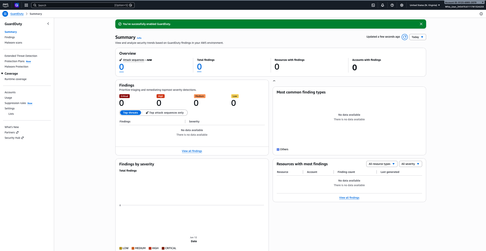
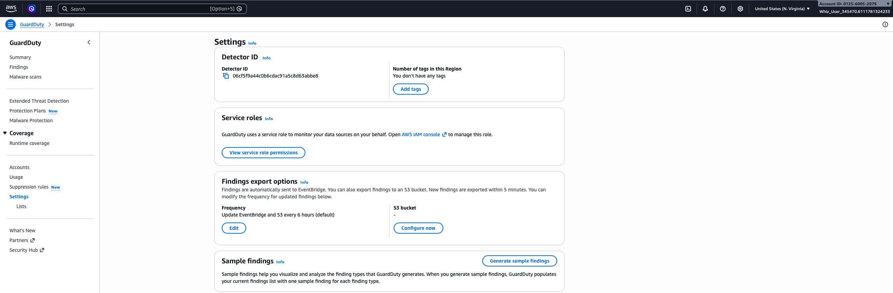
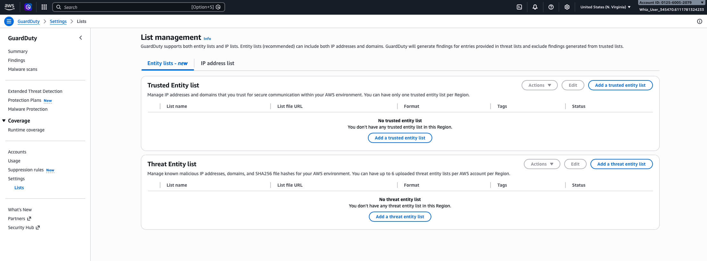
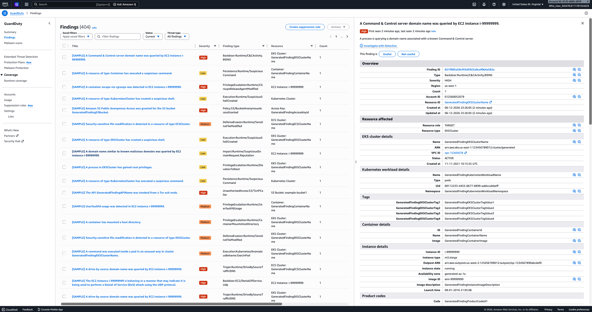
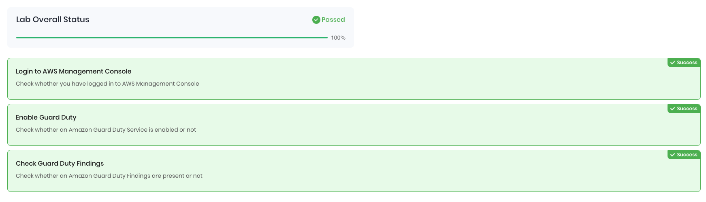

# Amazon GuardDuty Threat Detection

## Overview
Enabled and explored Amazon GuardDuty to demonstrate continuous threat detection and security monitoring across an AWS account. Generated sample findings to understand how GuardDuty identifies and categorizes potential security threats.

## Services Used
- Amazon GuardDuty

## What I Built
- Enabled Amazon GuardDuty in us-east-1 with a single click
- Explored the GuardDuty Detector ID and service role configuration
- Reviewed the List Manager for Trusted IP Lists and Threat IP Lists
- Generated sample findings to simulate real-world threat scenarios
- Analyzed individual finding details including severity, affected resource, threat type, and region
- Passed all lab validation checks at 100%
- Disabled GuardDuty after lab completion

## Walkthrough

### 1. GuardDuty Enabled

### 2. Settings — Detector ID

### 3. List Manager — Trusted IP and Threat IP Lists

### 4. Sample Findings Generated

### 5. Finding Detail View

### 6. Lab Validation Passed 100%

## Skills Demonstrated
- Cloud security monitoring and threat detection
- Amazon GuardDuty enablement and configuration
- Security findings analysis and severity classification
- Threat intelligence list management
- AWS Console navigation
- Security best practices and remediation awareness
