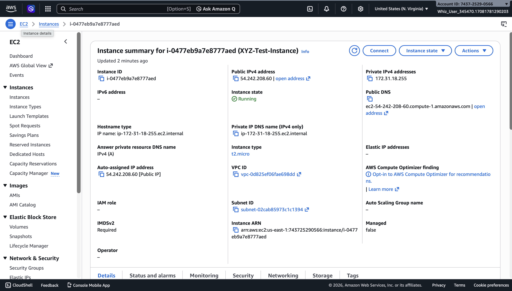
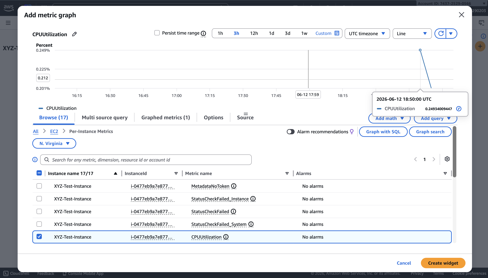
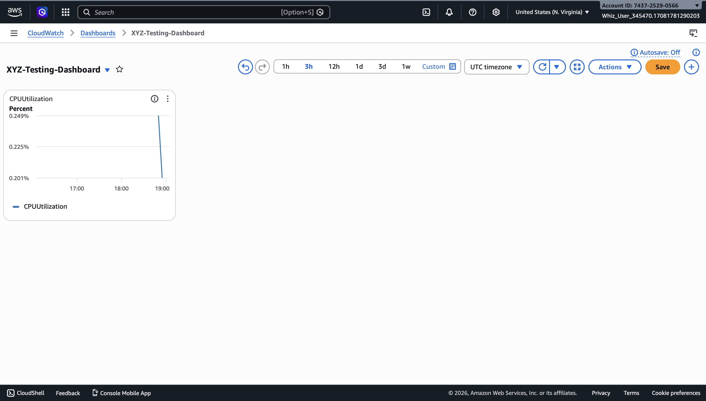
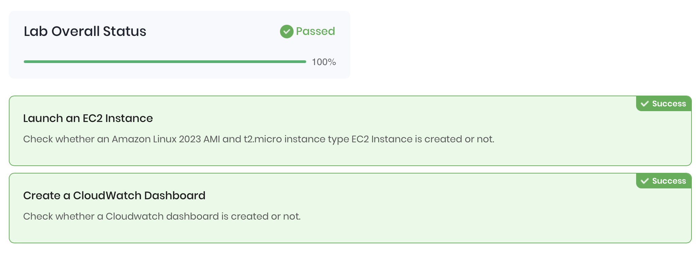

# CloudWatch Dashboard and Widget Challenge

## Overview
Built a CloudWatch monitoring dashboard for a simulated company (XYZ) testing environment, displaying real-time EC2 CPU utilization metrics using a custom widget.

## Services Used
- Amazon EC2
- Amazon CloudWatch

## What I Built
- Launched an EC2 instance (Amazon Linux 2023, t2.micro) with SSH and HTTP access in us-east-1
- Created a CloudWatch dashboard named XYZ-Testing-Dashboard
- Added a CPUUtilization metric widget scoped to the XYZ-Test-Instance
- Saved the dashboard and confirmed live CPU metrics were rendering
- Passed all lab validation checks at 100%

## Walkthrough

### 1. EC2 Instance Running

### 2. CloudWatch Metric Widget Configuration

### 3. Dashboard Saved with CPU Widget

### 4. Lab Validation Passed 100%

## Skills Demonstrated
- EC2 instance provisioning
- CloudWatch dashboard creation and configuration
- Metric widget setup for EC2 CPU monitoring
- AWS Console navigation
- Cloud observability and performance monitoring
