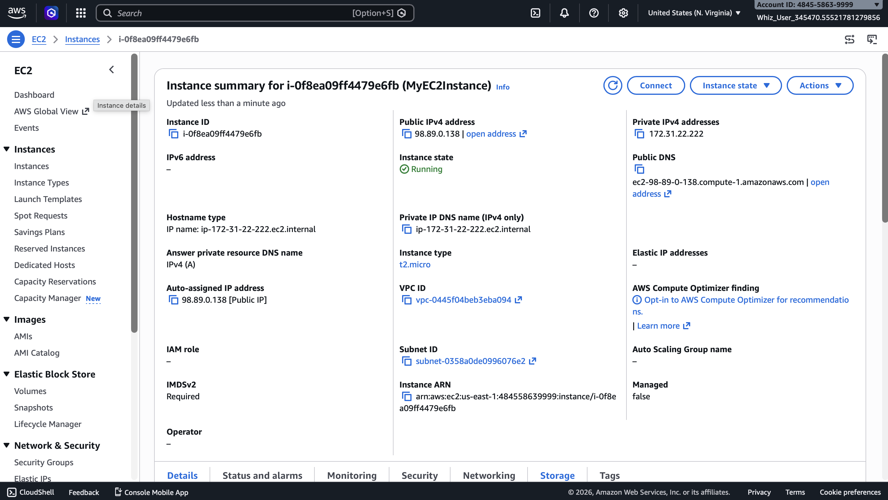
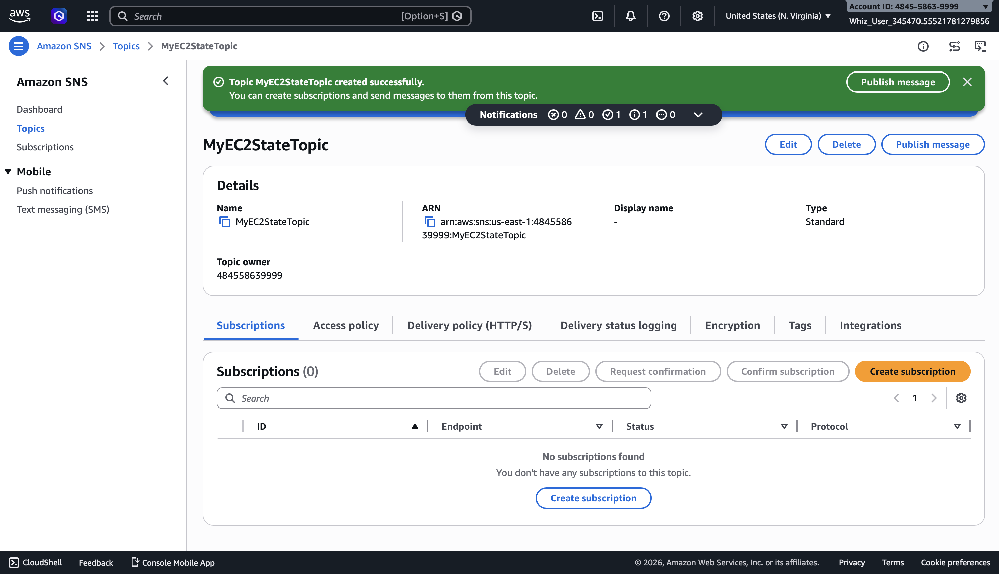
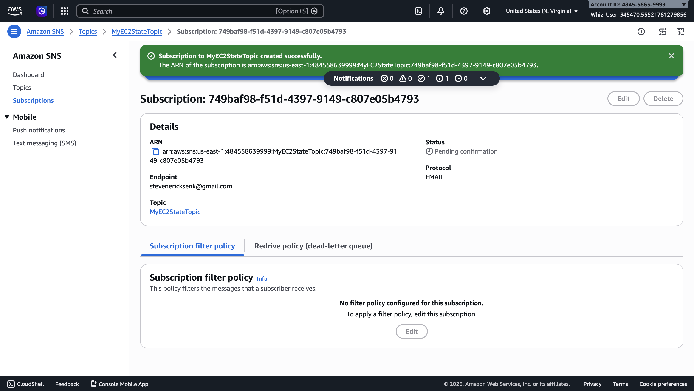
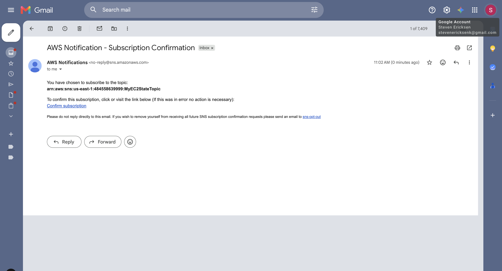
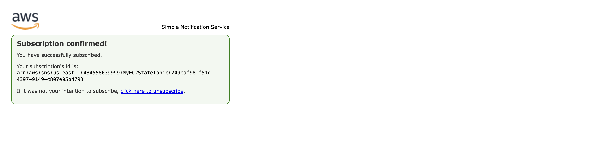
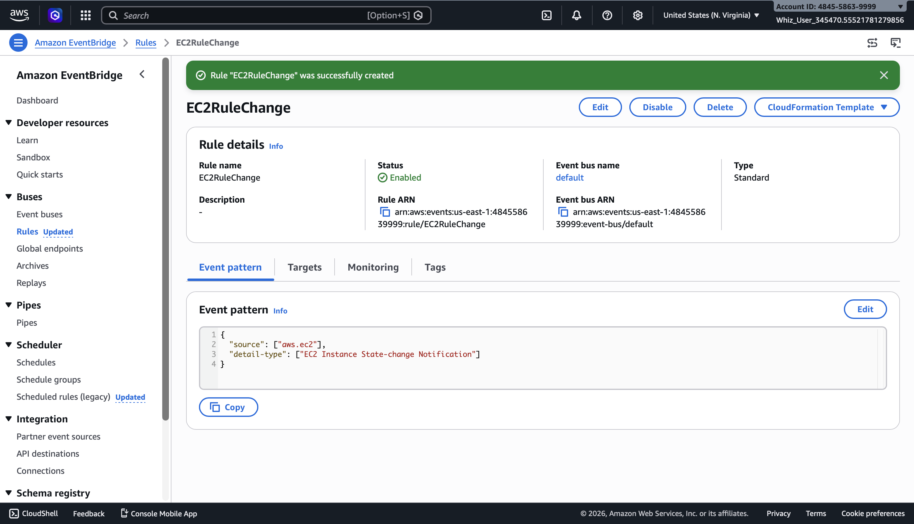
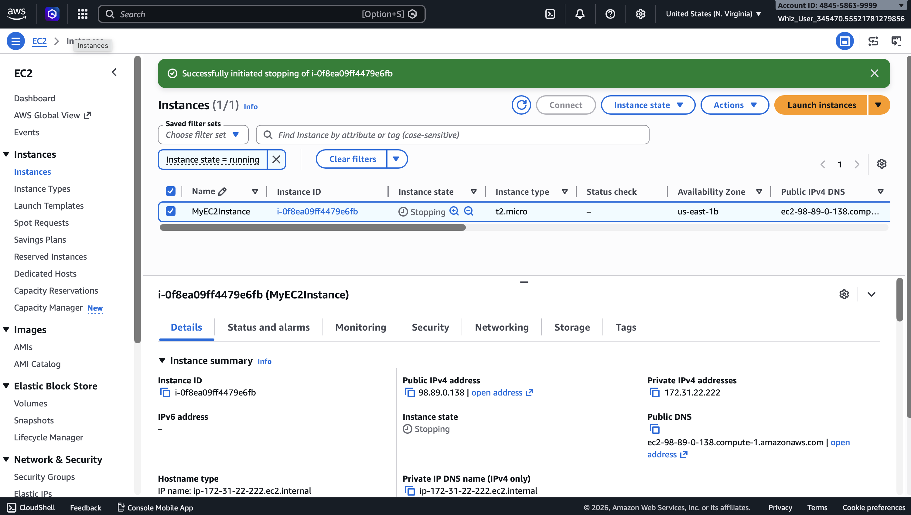
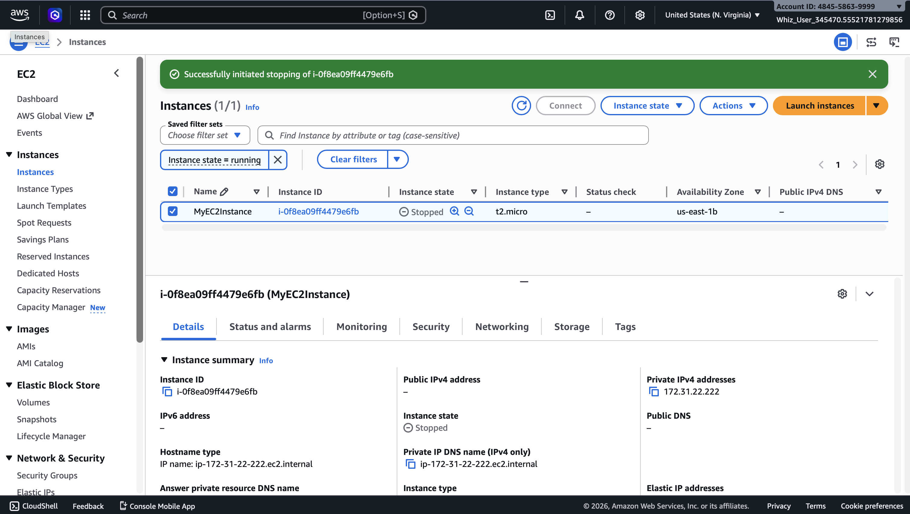
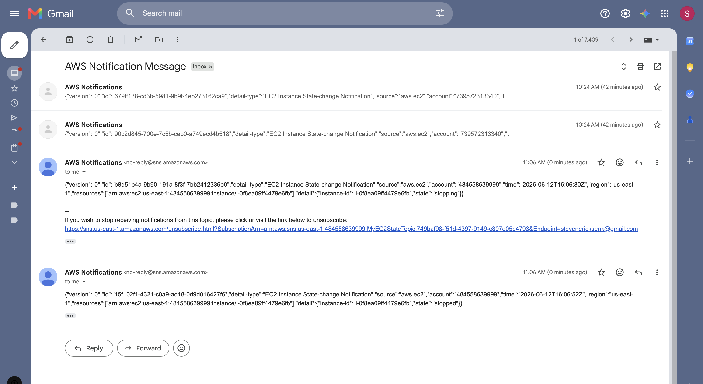

# EC2 Instance State Change Monitoring with CloudWatch & SNS

## Overview
Built a real-time monitoring solution that automatically notifies administrators when an EC2 instance changes state using Amazon EventBridge, SNS, and EC2.

## Services Used
- Amazon EC2
- Amazon SNS (Simple Notification Service)
- Amazon EventBridge (CloudWatch Events)

## What I Built
- Launched an EC2 instance (Amazon Linux 2023, t2.micro) in us-east-1
- Created an SNS topic with email subscription for notifications
- Configured an EventBridge rule to monitor EC2 instance state changes
- Tested the solution by stopping the EC2 instance and confirming email notification was received

## Walkthrough

### 1. EC2 Instance Running

### 2. SNS Topic Created

### 3. SNS Subscription Pending

### 4. Subscription Confirmation Email

### 5. Subscription Confirmed

### 6. EventBridge Rule Created

### 7. EC2 Instance Stopping

### 8. EC2 Instance Stopped

### 9. AWS Notification Email Received

### 10. Lab Validation Passed 100%

## Skills Demonstrated
- Cloud monitoring and alerting
- Event-driven architecture
- AWS Console navigation
- SNS topic and subscription configuration
- EventBridge rule creation
