# VPC Flow Logs with Amazon Athena

## Overview
This lab demonstrates building a complete AWS network monitoring pipeline — from VPC architecture through traffic generation to log analysis using SQL queries in Amazon Athena.

**Duration:** ~1 hour  
**Region:** US East (N. Virginia) us-east-1

---

## Architecture
- S3 Bucket (log destination with IAM delivery policy)
- Custom VPC with public subnet, Internet Gateway, and route table
- VPC Flow Logs → S3
- EC2 Instance (Amazon Linux 2023, t2.micro) generating HTTP traffic
- Amazon Athena querying flow log data via SQL

---

## Tasks Completed

| # | Task |
|---|------|
| 1 | Created S3 bucket with log delivery bucket policy |
| 2 | Created custom VPC (10.0.0.0/16) |
| 3 | Created and attached Internet Gateway |
| 4 | Created public subnet (10.0.1.0/24) with auto-assign public IP |
| 5 | Configured public route table with 0.0.0.0/0 → IGW route |
| 6 | Created VPC Flow Log (All traffic, 1-min interval, S3 destination) |
| 7 | Launched EC2 instance into custom VPC/subnet |
| 8 | SSH'd into EC2 and installed Apache HTTPD to generate traffic |
| 9 | Verified AWSLogs folder populated in S3 |
| 10 | Created Athena external table mapped to flow log S3 path |
| 11 | Ran SQL query returning 10 rows of parsed flow log data |
| 12 | Passed all lab validation checks (100%) |

---

## Screenshots

### S3 Bucket & Bucket Policy
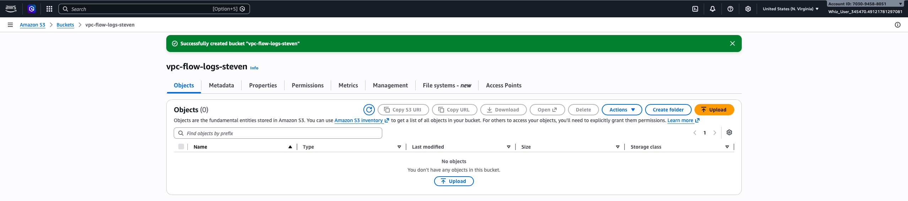
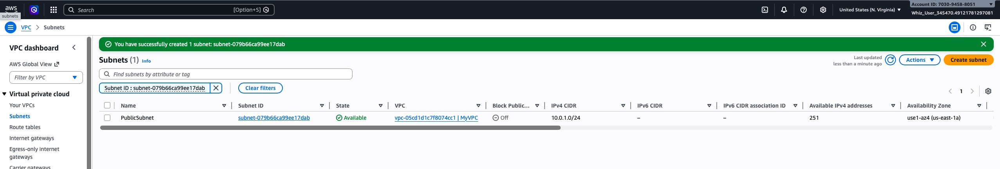

### VPC Configuration
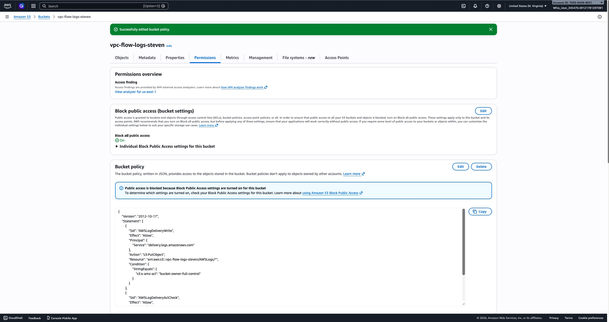
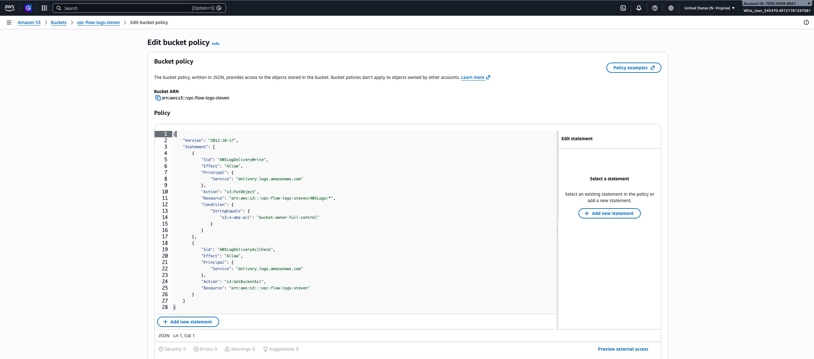
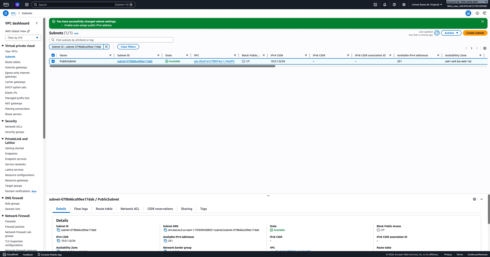
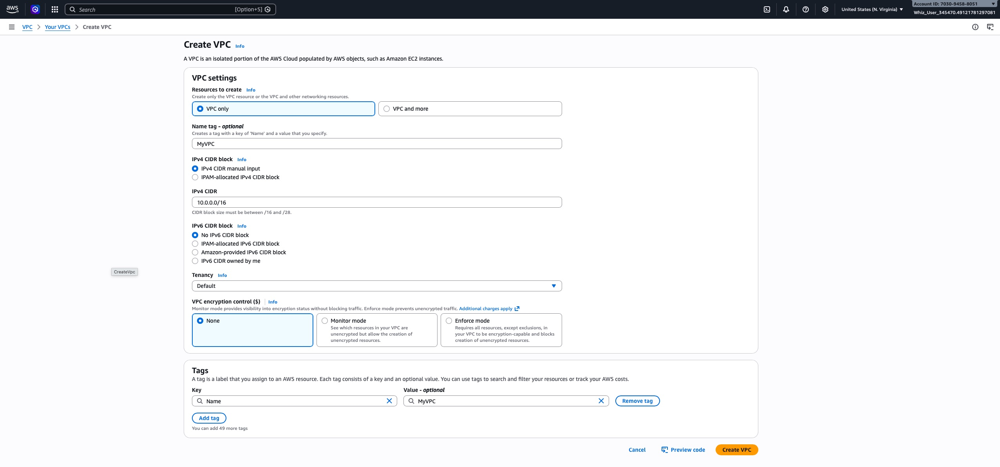
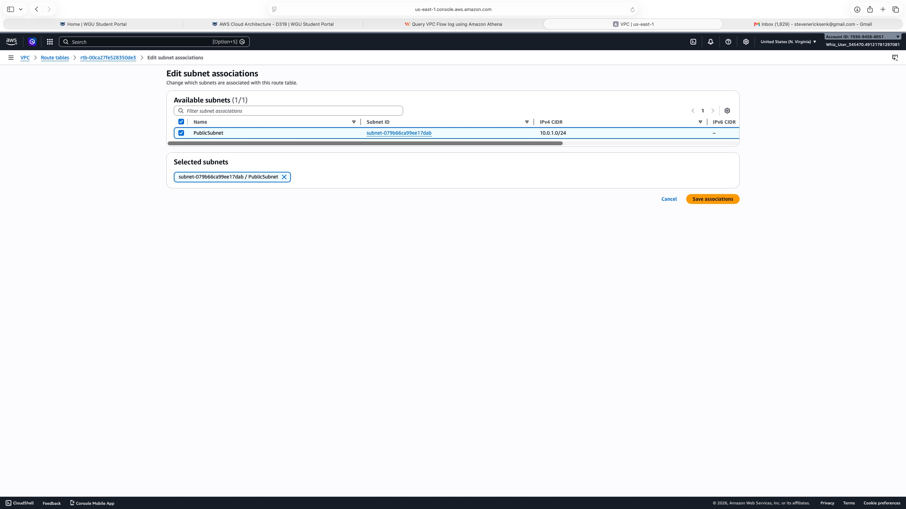
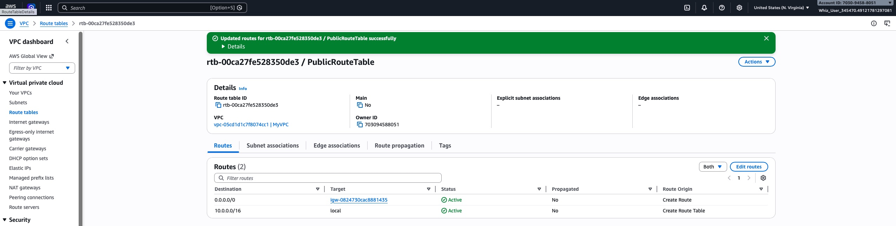

### VPC Flow Logs
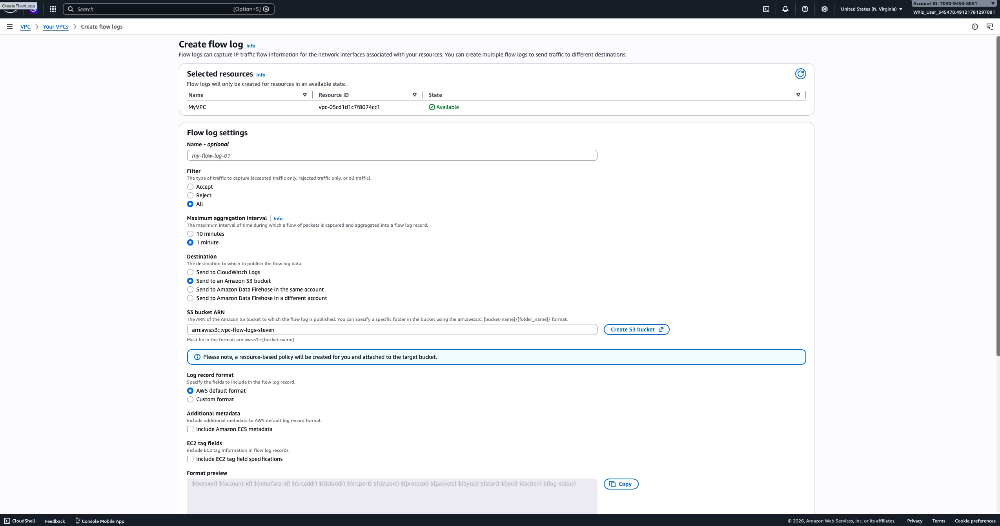
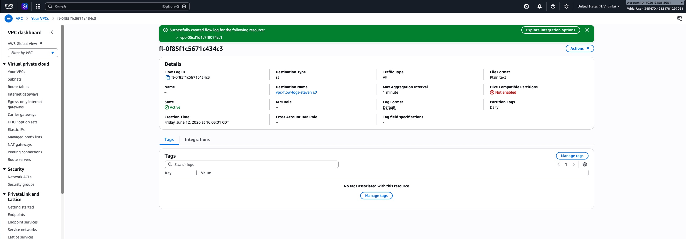
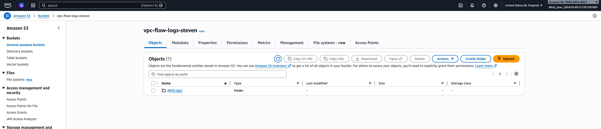

### EC2 & Traffic Generation
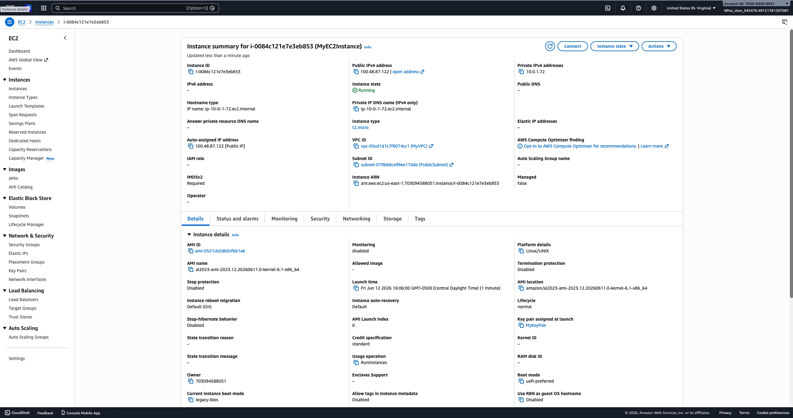
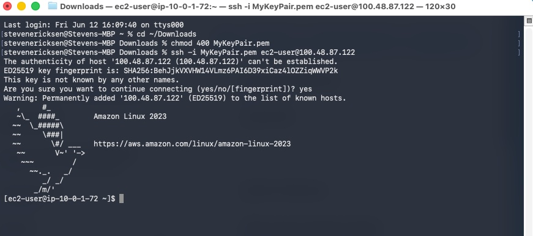

### Athena Query & Results
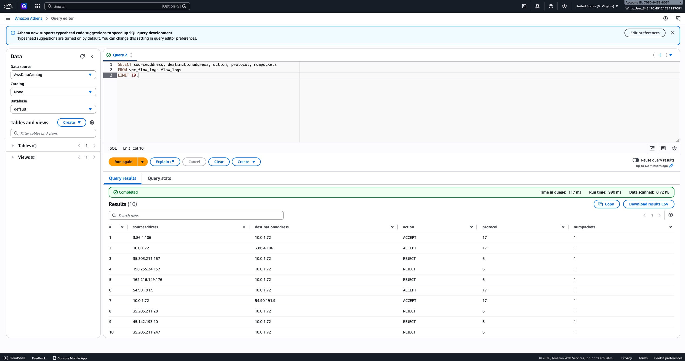
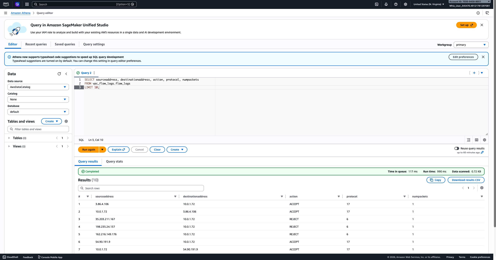

### Validation
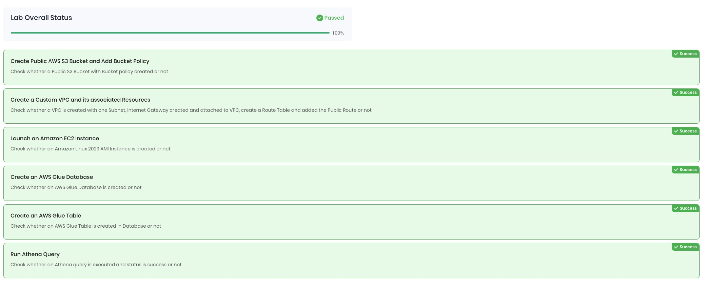

---

## Key Skills Demonstrated
- VPC design and networking (subnets, IGW, route tables)
- S3 bucket policy configuration for AWS log delivery
- VPC Flow Log setup and S3 integration
- EC2 provisioning and SSH access
- Amazon Athena external table creation and SQL querying
- End-to-end cloud observability pipeline
